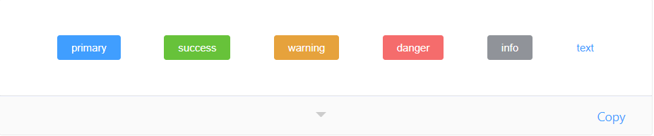
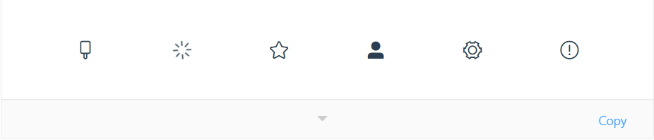
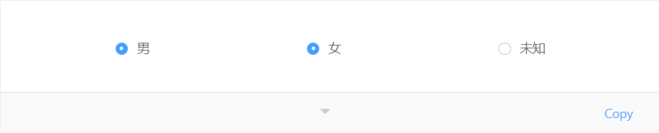
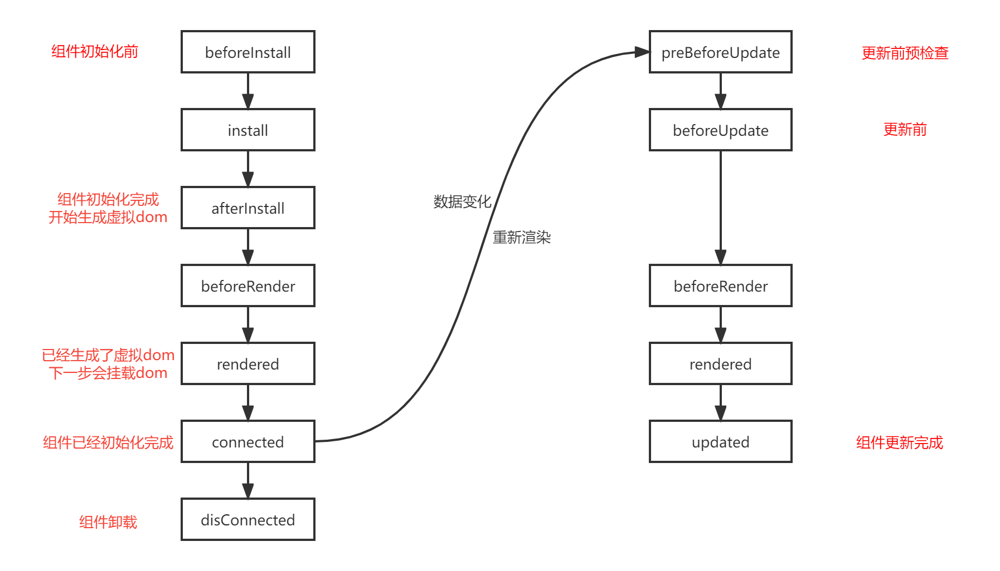

## 前言

WebComponent 方式是实现组件化的一种解决方案，目前社区内也有很多成熟对方案，如 [Omi](https://github.com/Tencent/omi) 、[stencil](https://github.com/ionic-team/stencil) ， 其中腾讯前端团队的 [Omi](https://github.com/Tencent/omi) 方案还是相当完善的。

[早些时间](https://blog.canyuegongzi.xyz/blog/web/defin-web-component-core) 笔者也在 Omi 的基础上封装了 [@canyuegongzi/web-core](https://www.npmjs.com/package/@canyuegongzi/web-core) ，但目前此种方案在使用方面尚存在不足，诸如属性定义繁琐、事件抛出缺乏灵活性、数据无法响应式等；故此最近在 web-core 基础上对相关的逻辑做了重构、升级成为 [@canyuegongzi/web-core-plus](https://www.npmjs.com/package/@canyuegongzi/web-core-plus) 。

简单对新旧定义组件方式做个类比：

**web-core方式定义**
```tsx
import * as css from './index.scss';
@CustomTag({ name: 'wu-tree' })
export default class WuTree extends CustomWebComponent {
    static css = css.default ? css.default : css
    static propTypes = {
        size: String,
        highlightCurrent: Boolean,
        showCheckbox: Boolean,
        data: Array
    }
    static defaultProps = {
        size: WebUiConfig.size,
        highlightCurrent: true,
        showCheckbox: false,
        data: []
    }

    static observedAttrList = [ "data" ];
    
    public isChecked: boolean | undefined;
    
    constructor() {
        super();
    }
    public render(props) {
        return (
            <div>组件</div>
        );
    }
}
```

利用旧版本的核心包在定义组件时，只能依赖 propTypes、defaultProps 定义属性，也无法利用生命周期钩子函数做自定义操作。

**web-core-plus方式定义**
```tsx
import { h, Component, Prop, Emit, Watch } from "@canyuegongzi/web-core-plus";
import css from './index.scss';

@Component({
    name: 'wu-plus-icon',
    css: css
})
export class WuIcon extends HTMLElement {
    constructor() {
        super();
    }
    @Prop({ default: '', type: String })
    public name: string;
    
    @Emit('change')
    public valueChange() {
        return this.name;
    }

    @Watch('name')
    private nameChange(newVal: string, oldVale:string) {
        console.log('值修改', oldVale, newVal);
    }

    public render(_renderProps= {}, _store = {}) {
        return (
            <i class={`wu-icon-${this.name}`} />
        );
    }
}

```

新版本的核心包在自定义组件时，可以通过装饰器直接定义相关的逻辑，如属性定义（Prop）、事件抛出（Emit）、数据监听（Watch），后续也会添加其他操作，也对虚拟dom以及 dif 相关的逻辑做了优化。

文章中相关代码均已提交到 github，欢迎 star。

[代码地址](https://github.com/canyuegongzi/web-component-plus)
[文档地址](https://canyuegongzi.github.io/component-plus/Basic/Button.html)

## 效果预览

基本按钮样式展示如下：



基本字体图标样式展示如下：



基本单选样式展示如下：



## web-core-plus

### 生命周期

通过钩子函数，开发者在自定义组件时可以增强生命周期节点的功能，比如可以通过 preBeforeUpdate（类似 react的 shouldComponentUpdate） 实现渲染优化。



web-core-plus 在底层定义了各个生命周期节点的接口，开发者可以通过 implements 实现相关的方法。

基本接口如下：

```ts
/**
 * 渲染前
 */
export interface OnBeforeRender<T = any> {
    beforeRender(): any;
}
/**
 * 渲染后
 */
export interface OnRendered<T = any> {
    rendered(): any;
}
/**
 * 更新前预检查
 */
export interface OnPreBeforeUpdate<T = any> {
    preBeforeUpdate(): boolean;
}
/**
 * 更新前
 */
export interface OnBeforeUpdate<T = any> {
    beforeUpdate(): any;
}
/**
 * 更新前
 */
export interface OnUpdated<T = any> {
    updated(): any;
}

/**
 * 组件挂载
 */
export interface OnConnected<T = any> {
    connected(shadowRoot: ShadowRoot): any;
}

/**
 * 组件挂载
 */
export interface OnDisConnected<T = any> {
    disConnected(shadowRoot: ShadowRoot): any;
}

/**
 * 组件挂载过程中的生命周期
 */
export interface OnInstall<T = any> {
    beforeInstall?(): any
    install?(): any
    afterInstall?(): any
    connected?(shadowRoot: ShadowRoot): any;
}

/**
 * 组件挂载过程中的生命周期
 */
export interface OnUpdate<T = any> {
    preBeforeUpdate?(): boolean
    beforeUpdate?(): any
    updated?(): any
}
```

### 装饰器实现

#### Props

Props 方式可以快速的定义自定义属性，框架底层对 Props 装饰的类成员做了拦截处理，当该类型数据被修改时，组件会走更新逻辑。

```ts
export interface PropOptions {
    default?: any,
    attr?: string,
    type?: PropTyp
}

/**
 * 属性装饰器
 * @param options
 * @constructor
 */
export function Prop(options: PropOptions = { default: undefined }): PropertyDecorator {
    return function (target: any, attr: any){
        const value = options.default || options.default || undefined;
        const keys: PropOptions[] = Reflect.getMetadata(PROP_META_KEY, target) ?? [];
        keys.push({ default: value, type: options.type, attr });
        Reflect.defineMetadata(PROP_META_KEY, keys, target);
    };
}
```
#### Emit

Emit 方式可以快速的定义自定义事件，底层采用 new CustomEvent 向外穿透抛出事件。

在组件初始化时，被该种装饰器修饰的成员函数会被重写，底层采用 Object.defineProperty 定义get，代码如下（injectEmit）：

```ts
export interface EventOptions {
    methodName?: any,
    methodFun?: any,
    eventName?: string,
}

export function Emit(event?: string): any{
    return function(target: any, methodName: string, desc: any) {
        const functions: EventOptions[] = Reflect.getMetadata(COMPONENT_CUSTOM_EVENT, target) ?? [];
        const methodFun = desc.value;
        const eventName = (event) ? event: toDotCase(methodName);
        functions.push({ methodName: methodName, methodFun, eventName });
        Reflect.defineMetadata(COMPONENT_CUSTOM_EVENT, functions, target);
    }
}

/**
 * 事件响应逻辑处理
 * @param functions
 * @param customElement
 */
function injectEmit(functions: EventOptions[], customElement: any) {
    functions.forEach((event: EventOptions) => {
        Object.defineProperty(customElement.prototype, event.methodName, {
            get: function() {
                return function(...args) {
                    const result: any = event.methodFun.call(this, args);
                    if (result) {
                        const evtName = (event.eventName) ? event.eventName: toDotCase(event.methodName);
                        customElement.prototype._dispatchEvent.call(this, evtName, result);
                    }
                };
            }
        });
    });
}
```

#### Watch

该代码不作展示，感兴趣的开发者可以酌情阅读源码。

#### Component
该装饰器会重写被装饰的类，其中逻辑见代码 [ComponentDecorators](https://github.com/canyuegongzi/web-component-plus/blob/master/packages/web-core-plus/src/decorators/ComponentDecorators.ts) 。

```ts
export function Component(options: CustomTagOptions): ClassDecorator {
    return (target: any) => {
        // 定义的属性
        const keys: PropOptions[] = Reflect.getMetadata(PROP_META_KEY, target.prototype) ?? [];
        // 需要要抛出的事件
        const functions: EventOptions[] = Reflect.getMetadata(COMPONENT_CUSTOM_EVENT, target.prototype) ?? [];
        // 被监听的属性
        const watchs: WatchMetaOptions[] = Reflect.getMetadata(COMPONENT_WATCH, target.prototype) ?? [];
        // 数据处理成响应式
        const customElement: any = class extends (target as { new (): any }) {
            // CODE....
            constructor() {
                super();
            }

            /**
             * 定义的生命周期，函数内部会调用重写的方法
             */
            public afterInstall() {
                super.afterInstall?.();
            }

            // CODE....

        };
        // 数据响应式处理
        injectKeys(keys, watchs, customElement);
        // 事件代理处理
        injectEmit(functions, customElement);
        if (!customElements.get(options.name)) {
            // 定义组件
            customElements.define(options.name, customElement, options.options || {});
        }
        return customElement;
    };
}
```

这里着重介绍一个方法，connectedCallback（组件挂载完成）；

```ts
class Test {
    public connectedCallback() {
        // 初始化 ShadowRoot
        const shadowRoot: ShadowRoot = this.initShadowRoot();
        // 挂载时将标签上的属性转换为props
        this.attrsToProps();
        // 调用相关的生命周期函数
        this.beforeInstall();
        this.install();
        this.afterInstall();
        this.beforeRender();
        // jsx 转换为虚拟donm
        const rendered = this.render();
        // 通过diff 算法生成dom结构
        this.rootNode = diff(null, rendered, null, this);
        // 此处会挂载真实的dom
        if (Array.isArray(this.rootNode)) {
            this.rootNode.forEach(item => shadowRoot.appendChild(item));
        } else {
            this.rootNode && shadowRoot.appendChild(this.rootNode);
        }
        this._shadowRootDom = shadowRoot;
        this._shadowRoot = shadowRoot;
        this.isInstalled = true;
        this.rendered();
        this.connected(shadowRoot);
    }
}
```

## wu-plus-button

### 定义

在此简单示例如何定义一个和 ElementUI 中的 Button 组件。

```tsx
import { h, Component, Prop } from "@canyuegongzi/web-core-plus";
import css from './index.scss';
import { UISize } from "@/interface";
import { extractClass } from "@/common";
type WuButtonType = 'primary' | 'success' | 'warning' | 'danger' | 'info'
type NativeType = 'button' | 'submit' | 'reset'

@Component({
    name: 'wu-plus-button',
    css: css
})
export class WuButton extends HTMLElement {
    constructor() {
        super();
    }

    @Prop({ default: 'primary', type: String })
    public type: WuButtonType;

    @Prop({ default: 'mini', type: String })
    public size: UISize;

    @Prop({ default: false, type: Boolean })
    public plain: boolean;

    @Prop({ default: false, type: Boolean })
    public round: boolean;

    @Prop({ default: false, type: Boolean })
    public circle: boolean;

    @Prop({ default: false, type: Boolean })
    public loading: boolean;

    @Prop({ default: false, type: Boolean })
    public disabled: boolean;

    @Prop({ default: '', type: String })
    public icon: string;

    @Prop({ default: 'button', type: String })
    public nativeType: NativeType;

    @Prop({ default: '', type: String })
    public text: string;


    public render(_renderProps= {}, _store = {}) {
        return(
            <button
                disabled={this.disabled}
                {...extractClass({}, 'wu-button', {
                    ['wu-button-' + this.type]: this.type,
                    ['wu-button-' + this.size]: this.size,
                    'is-plain': this.plain,
                    'is-round': this.round,
                    'is-circle': this.circle,
                    'is-disabled': this.disabled
                })}
                type={this.nativeType}
            >
                {this.loading && [
                    <svg
                        class="loading"
                        viewBox="0 0 1024 1024"
                        focusable="false"
                        data-icon="loading"
                        width="1em"
                        height="1em"
                        fill="currentColor"
                        aria-hidden="true"
                    >
                        <path d="M988 548c-19.9 0-36-16.1-36-36 0-59.4-11.6-117-34.6-171.3a440.45 440.45 0 00-94.3-139.9 437.71 437.71 0 00-139.9-94.3C629 83.6 571.4 72 512 72c-19.9 0-36-16.1-36-36s16.1-36 36-36c69.1 0 136.2 13.5 199.3 40.3C772.3 66 827 103 874 150c47 47 83.9 101.8 109.7 162.7 26.7 63.1 40.2 130.2 40.2 199.3.1 19.9-16 36-35.9 36z"/>
                    </svg>,
                    ' ',
                ]}
                {this.text}
                <slot/>
            </button>
        );
    }
}

```

### 使用

```html
<wu-plus-button id="testDom2" type="primary">按钮</wu-plus-button>
<wu-plus-button id="testDom3" type="success">按钮</wu-plus-button>
<wu-plus-button id="testDom4" type="info">按钮</wu-plus-button>
```
## 思考

webComponent 的组件化和 vue、react 等主流框架的组件化从结果上看其实并无差别，但从开发中的体验来说 webComponent 尚不完善；而且 webComponent 和主流的框架侧重点还是有区别的，目前的前端框架具有数据绑定、状态管理和相当标准化的代码库等功能所带来的额外价值，具体问题还得具体对待。

文章只是起到抛砖引玉的作用，如果有对这个方向感兴趣的同学可以直接拉 github 代码阅读。

喜欢折腾的同学可以提 PR 和笔者一起完善这个库。
